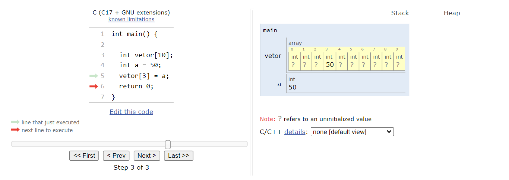

# Alocação Sequencial
É o armazenamento de dados de forma sequencial na memória do computador. Isto quer dizer que as posições da memória ocupadas serão contíguas.

Na alocação sequencial o programa precisa informar **previamente** todo o **tamanho da memória** que será necessário.

A alocação sequencial é representada por **arrays** ou **vetores**.

# Vetor (Array Unidimensional)

Vetor ou array unidimensional é uma estrutra de dados que armazena uma coleção de elementos do **mesmo tipo**, onde cada elemento é acessado através de um **índice numérico**.

Array é uma estrutura **homogênea** que representa um conjunto de elementos de dados do **mesmo tipo**.

Existem 3 (três) tipos de arrays:

- Unidimensional: Vetor
- Bidimensional: Matriz
- Tridimensional: Cubo

Implementação do vetor (array unidimensional) em Linguagem C:

Abaixo o código para um vetor(array):

```sh
int vetor[10];
```
Informa ao compilador que deverão ser reservadas posições de memória suficientes para armazenar 10 elementos do tipo inteiro.

Atenção: Posição de memória ≠ Tamanho  
O número de posições necessárias depende do tamanho do tipo de dado e da palavra da memória.

Código:

```sh
int main()
{
    int vetor[10];
    int a = 50;
    vetor[3] = a;
    return 0;
}
```
Visualização da execução do código, usando o programa Python Tutor (https://pythontutor.com/) configurado para a Linguagem C:



1. Foi criado um vetor(array) com 10 posições para elementos do tipo inteiro e o valor 50 foi armazenado na 4ª posição. Elemento do vetor(array) com índice 3 representado por `vetor[3]` que armazena o valor da variável `a`.  
2. A variável `a` , do tipo inteiro, recebeu, por operação de atribuição, o valor 50.
