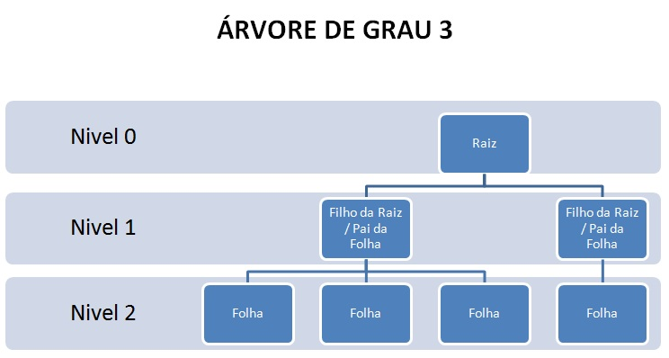

# Árvores

1. Uma árvore é uma estrutura de dados hierárquica composta por nós conectados por arestas.
2. Cada árvore tem um nó especial chamado de raiz, a partir do qual todos os outros nós são alcançáveis.

> Os elementos que formam uma árvore são chamados **nós** ou **vétices** da árvore, sendo que um nó é especial: o nó **raiz**, que é o único nó existente na posição hierárquica mais alta. Uma árvore vazia não possui nó raiz.

3. Os nós da árvore são organizados em níveis, começando pelo nível 0 para a raiz e aumentando conforme a distância da raiz aumenta.

Imagem. Fonte: https://systevolution.files.wordpress.com/2011/08/arvore1.jpg

5. Cada nó pode ter zero ou mais nós filhos, e um nó sem filhos é chamado de folha.
6. As árvores são amplamente utilizadas em ciência da computação para modelar hierarquias de dados, como a estrutura de pastas em um sistema de arquivos, a estrutura de um documento HTML, ou a organização de elementos em uma árvore genealógica.
7. Existem diferentes tipos de árvores, incluindo árvores, incluindo árvores binárias, árvores de busca binária, árvores balanceadas, árvores B e árvores trie, cada uma com propriedades e aplicações específicas.

