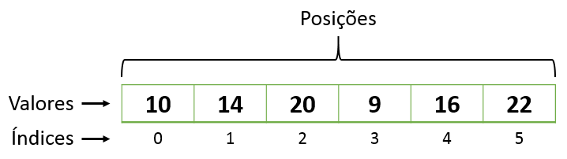

# Listas

Uma lista é uma estrutura de dados que armazena uma coleção (conjunto) de elementos. Estes elementos podem ser de qualquer tipo de dado, como números, strings, objetos etc.

Uma lista, por definição, não precisa ser ordenada para ser considerada como tal. Na verdade existem diversos tipos de listas que não possuem ordem definida, como listas encadeadas simples e listas circulares.

O que define uma lista é a estrutura de dados utilizada para armazenar os elementos, que permite a inserção, remoção e acesso aos elementos de forma eficiente. A ordem dos elementos é apenas um detalhe que pode variar de acordo com o tipo de lista e a necessidade de aplicação.

Em alguns casos, a ordem dos elementos pode ser importante para o funcionamento da lista, como em listas ordenadas, onde a busca por um elemento específico pode ser realizada de forma mais eficiente. No entanto, em muitos outros casos, a ordem não é relevante, e uma lista desordenada pode ser perfeitamente adequada.

As listas podem ser implementadas de diversas maneiras, mas as mais comuns são:

- **Listas encadeadas:** Cada elemento da lista é armazenado em umnó, que contém o valor do elemento e um ponteiro para o próximo nó.
- **Vetores:** OS elementos da lista são armazenados em um array (arranjo) contíguo de memória.

A figura abaixo ilustra a representação de listas encadeadas.

Imagem. Fonte: https://algoritmosempython.com.br/cursos/algoritmos-python/estruturas-dados/listas-encadeadas/

A figura abaixo iustra a representação de um array (arranjo ou vetor) unidimensional.

Imagem. Fonte: https://ifrnead.github.io/rubynapratica/contents/programacao_estruturada/arrays.html

## Tipos de lista:

**1. Lista Encadeada Simples:**

- Implementação mais simples.
- Cada nó armazena o valor e o ponteiro para o próximo nó.
- Inserção e remoção no início da lista são eficientes (tempo constante).
- Inserção e remoção no final da lista são menos eficientes (tempo linear).

**2. Lista Duplamente Encadeada:**

- Cada nó armazena o valor, o ponteiro para o próximo nó e o ponteiro para o nó anterior.
- Inserção e remoção em qualquer lugar da lista são eficientes (tempo constante).
- Mais complexa de implementar do que a lista encadeada simples.

**3. Lista Circular:**

- Os elementos da lista formam um círculo, ou seja, o último nó aponta para o primeiro nó.
- Permite a inserção e remoção de elementos em qualquer lugar da lista.
- Útil para implementar filas e pilhas.

**4. Pilha (Stack):**

- Uma pilha é uma lista LIFO (Last-In-First-Out), ou seja, o último elemento inserido é o primeiro a ser removido.
- As operações básicas em uma pilha são:
  - **Push:** Inserir um elemento no topo da pilha.
  - **Pop:** Remover um elemento do topo da pilha.
  - **Peek:** Retornar o elemento do topo da pilha sem removê-lo.
- As pilhas são usadas em diversas aplicações, como:
  - Desfazer/refazer operações em um editor de texto.
  - Avaliação de expressões matemáticas.
  - Implementação de algoritmos de recursão.
 
**5. Fila (Queue):**

- Uma fila é uma lista FIFO (First-In-First-Out), ou seja, o primeiro elemento inserido é o primeiro a ser removido.
- As operações básicas em uma fila são:
  - **Enqueue:** Inserir um elemento no final da fila.
  - **Dequeue:** Remover um elemento do início da fila.
  - **Peek:** Retornar o elemento do início da fila sem removê-lo.
- As filas são usadas em diversas aplicações, como:
  - Simulação de filas de espera.
  - Buffering de dados.
  - Implementação de algoritmos de ordenação.

 ## Principais Características:

| Tipo de Lista | Ordem de Inserção/Remoção | Implementação | Operações Básicas | Aplicações |
 --------------|---------------------------|---------------|-------------------|--------------|
| Lista Encadeada Simples | LIFO | Simples | Push, Pop, Peek | Desfazer/refazer, Avaliação de expressões, Recursão |
| Lista Duplamente Encadeada | LIFO | Mais complexa | Push, Pop, Peek | Simulação de filas de espera, Buffering de dados, Ordenação | 
| Lista Circular | LIFO | Mais complexa | Push, Pop, Peek | Simulação de filas de espera, Buffering de dados, Ordenação |
| Pilha | LIFO | Simples | Push, Pop, Peek | Desfazer/refazer, Avaliação de expressões, Recursão |
| Fila | FIFO | Simples | Enqueue, Dequeue, Peek | Simulação de filas de espera, Buffering de dados, Ordenação |

## Considerações Finais:

A escolha do tipo de lista mais adequado para uma aplicação depende de diversos fatores, como a ordem de inserção e remoção dos elementos, a necessidade de acesso rápido a elementos específicos e a eficiência das operações básicas.

É importante entender as principais características de cada tipo de lista para poder escolher a mais adequada para cada necessidade.
