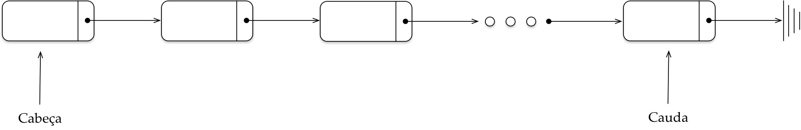

# Listas

Uma lista é uma estrutura de dados que armazena uma coleção (conjunto) de elementos. Estes elementos podem ser de qualquer tipo de dado, como números, strings, objetos etc. As listas podem ser implementadas de diversas maneiras, mas as mais comuns são:

- **Listas encadeadas:** Cada elemento da lista é armazenado em umnó, que contém o valor do elemento e um ponteiro para o próximo nó.
- **Vetores:** OS elementos da lista são armazenados em um array contíguo de memória.

A figura abaixo ilustra a representação de listas encadeadas.

Imagem. Fonte: https://algoritmosempython.com.br/cursos/algoritmos-python/estruturas-dados/listas-encadeadas/

## Tipos de lista: 
